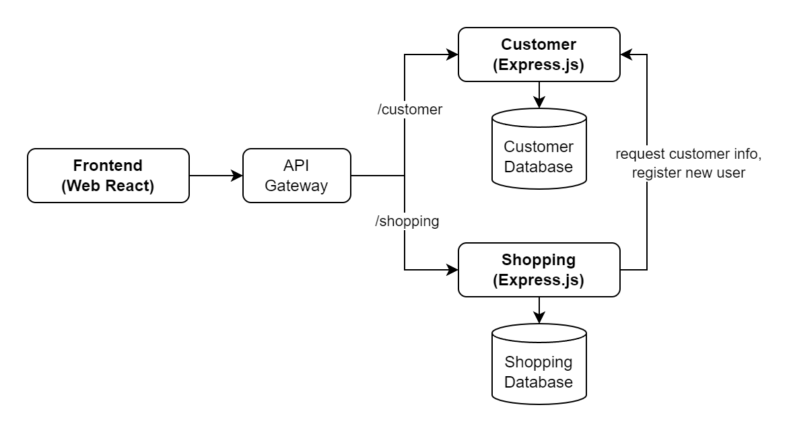
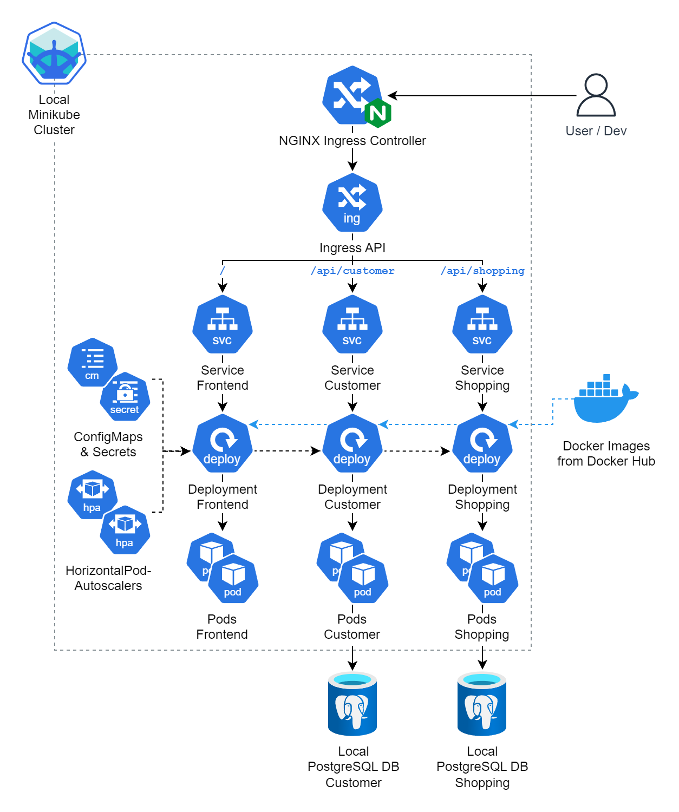

## EKS Demo Coffee Shop 
A microservices project used to demo deployment to AWS EKS

### Apps (Microservices) used for this project
[Frontend](https://github.com/MortredN/eks-demo-coffeeshop-frontend) (Node.js, React, Vite)

[Backend Customer](https://github.com/MortredN/eks-demo-coffeeshop-customer) (Express.js) - Handling auth and customers

[Backend Shopping](https://github.com/MortredN/eks-demo-coffeeshop-shopping) (Express.js) - Handling products and orders

### Kubernetes Deployment - Local

For local deployment, I use Minikube for development purposes. Manifest files can be found in `manifests-local`.

