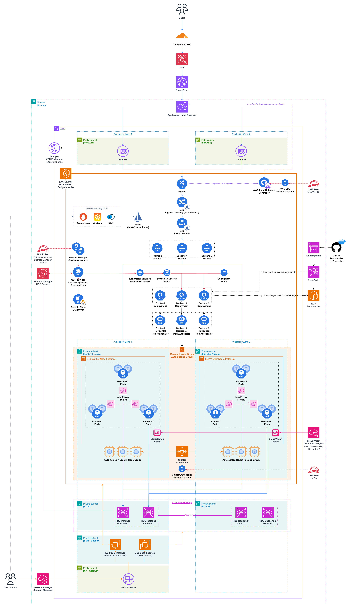

## EKS Demo Coffee Shop 
A microservices project used to demo deployment to AWS EKS

### Apps (Microservices) used for this project
[Frontend](https://github.com/MortredN/eks-demo-coffeeshop-frontend) (Node.js, React, Vite)

[Backend Customer](https://github.com/MortredN/eks-demo-coffeeshop-customer) (Express.js) - Handling auth and customers

[Backend Shopping](https://github.com/MortredN/eks-demo-coffeeshop-shopping) (Express.js) - Handling products and orders


### Kubernetes Deployment - AWS

For full step-by-step walkthrough using:
* Terraform - [Check out this Notion document here](https://mortredn.notion.site/Step-by-step-Terraform-AWS-15a64caecee580699bbced28df58352d)
* ```eksctl``` - [Check out this Notion document here](https://mortredn.notion.site/Step-by-step-AWS-Console-eksctl-12364caecee580a99a85d8007e9dbb52)



### Kubernetes Deployment - Local

For local deployment, I use Minikube for development purposes. Manifest files can be found in `manifests-local`.


